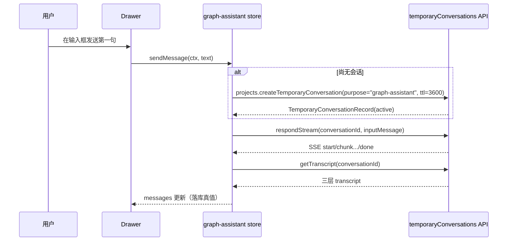

# Studio 图编辑器对接临时对话 — 设计文档

> 状态：v1 已实现（Phase 1~3 落地，导出与 localStorage 恢复为开放项）
> 范围：`apps/studio` 前端
> 关联：[临时对话 API](../vitepress/reference/api/temporary-conversations.md)、[临时对话为什么重要](../vitepress/ideas/why-temporary-conversation.md)、[NodeGraph Runtime](../vitepress/reference/api/node-graphs.md)
> 最后更新：2026-06-27

---

## 目录

1. [背景与动机](#1-背景与动机)
2. [目标与非目标](#2-目标与非目标)
3. [现状盘点](#3-现状盘点)
4. [设计总览](#4-设计总览)
5. [详细设计](#5-详细设计)
6. [数据模型与类型映射](#6-数据模型与类型映射)
7. [UI/UX 设计](#7-uiux-设计)
8. [错误处理与边界](#8-错误处理与边界)
9. [实施计划（分阶段）](#9-实施计划分阶段)
10. [测试策略](#10-测试策略)
11. [风险与开放问题](#11-风险与开放问题)
12. [附录](#12-附录)

---

## 1. 背景与动机

Studio 的图编辑器（`apps/studio/src/modules/graph`）让用户可视化地编排一张 NodeGraph：增删节点、连线、改配置、分组、保存版本。但面对一大堆节点和参数，用户经常「想改，却不知道从哪里下手」——哪个节点管叙事节奏、哪个参数控制记忆提取、改了这里会不会牵连那里。

[临时对话为什么重要](../vitepress/ideas/why-temporary-conversation.md) 一文给出的答案是：与其把节点图做得更简单，不如给「让 AI 帮你改」这件事一个安全的发生位置。用户在一段**临时对话**里描述意图（「叙事节奏慢一点、记忆提取更保守」），AI 在同一个容器里理解节点图、运行工具、给出方案，最后把方案**显式导出为候选**，由用户确认后才生效。

这段「帮我改配置 / 辅助理解」的对话有三个特征，恰好与临时对话的语义边界吻合：

- 不是剧情，**不应进入主叙事正史**；
- 可能多轮往返，需要**完整的多轮对话能力**（楼层、消息、流式输出）；
- 产出需要**一条受控的、可审计的路径**回到正式配置，而不是直接生效。

后端已经把这套容器做扎实（见第 3 节）。本设计描述 **Studio 前端如何对接它**：在图编辑器里挂上一个临时对话助手，让用户能就当前项目 / 图与 AI 对话，并复用现有聊天的流式与渲染基建。

---

## 2. 目标与非目标

### 2.1 目标

- G1：在图编辑器内提供一个**临时对话助手抽屉**，用户可在当前项目上下文中发起、查看、续写一段临时对话。
- G2：复用现有 `lib/chat` 的**流式（SSE）对接范式**与 UI 习惯，避免重造对话内核。
- G3：完整对接临时对话的**生命周期**：创建（基于 Project / Session）→ 追加 / 生成 → 读取 transcript → finalize / discard / cancel。
- G4：所有网络访问统一经 `@tavern/sdk`（`apiClient`），随当前后端连接与鉴权动态切换，**不旁路** `apps/web` 的 workspace-api。
- G5：明确「草稿不污染正史」的前端契约：默认 `return_inline`，结果不自动写回任何正式位置；导出走显式动作。

### 2.2 非目标

- NG1：**不实现** AI 自动改图（理解图 → 生成 patch → 写回图定义）。该能力属于图运行时的 `agent.call` 节点 + `nodegraph.patch.submit_proposal` → Project Inbox 提案链路，在一次 *图运行* 内发生，不是 UI 临时对话的职责。本设计把它列为北极星（第 11 节），v1 只交付对话容器。
- NG2：**不实现**临时对话的 list / search / branch / edit-and-regenerate（后端本就不提供，见 API 文档「边界与生命周期」）。
- NG3：**不改动**后端任何接口、schema 或 SDK 资源；如发现缺口，单列在第 11 节。
- NG4：`page_staged_write` 导出在 v1 仅做**预留**（见 5.4.5），因为图编辑器主要在 Project 作用域、缺少明确的目标 session page。

---

## 3. 现状盘点

### 3.1 后端已提供的能力（契约）

后端临时对话系统已落地，前端可直接消费。下表是本设计会用到的 SDK 入口（均已在 `@tavern/sdk` 的 `apiClient` 上）：

| 能力 | SDK 入口 | 说明 |
| ---- | ---- | ---- |
| 基于 Project 创建 | `apiClient.projects.createTemporaryConversation({ projectId, input })` | 从 Project 生效配置派生；图编辑器默认走这条 |
| 基于 Session 创建 | `apiClient.sessions.createTemporaryConversation({ sessionId, input })` | 顶栏选中 session 时可选 |
| 读取详情 | `apiClient.temporaryConversations.getDetail({ conversationId })` | 返回 `TemporaryConversationRecord`（含 status / 生命周期时间戳） |
| 追加消息 | `apiClient.temporaryConversations.appendMessage({ conversationId, role, content })` | 只追加，不触发生成 |
| 生成（JSON） | `apiClient.temporaryConversations.respond({ conversationId, inputMessage? })` | 非流式 |
| 生成（SSE） | `apiClient.temporaryConversations.respondStream({ conversationId, inputMessage?, signal, on* })` | 流式，回调面与 `sessions.respondStream` 同源 |
| 读取 transcript | `apiClient.temporaryConversations.getTranscript({ conversationId })` | floor / page / message 三层 |
| finalize / discard / cancel | `apiClient.temporaryConversations.{finalize,discard,cancel}({ conversationId })` | 进入终态后拒绝写入 |
| 导出候选 | `apiClient.temporaryConversations.exportToPageStagedWrite({ conversationId, targetPageId, ... })` | 唯一导出目标 `page_staged_write` |

`createTemporaryConversation*` 的输入：

```ts
type TemporaryConversationCreateInput = {
  title?: string;
  purpose: string;                 // 必填，1-120 字符，如 "graph-assistant"
  retentionPolicy?: "delete_on_finalize" | "ttl" | "keep_for_debug";
  ttlSeconds?: number;             // 仅 retentionPolicy = "ttl" 时允许，1-86400
};
```

关键边界（来自 API 文档，前端必须遵守）：

- 公共 API 只返回 `visibility = client_visible` 的资源；`internal`（agent-private）按 404 处理——UI 创建的对话默认就是 `client_visible`。
- `respond` 的 JSON / SSE 模式都默认只返回 **inline 结果**，不自动写主叙事。
- T2 阶段固定只在分支 `main` 上运行。
- TTL 过期是**惰性检查**：下一次读写入口触发时资源原子转 `expired`；前端需把 `409 conversation_not_active` 当作正常终态信号处理。

> 图运行时一侧的对接（`agent.call` 节点的 `temporary_conversation` 介质）已在后端就绪，但那是「图运行内部调用 Agent」的路径，与本设计的「UI 临时对话助手」是两件事，见 NG1。

### 3.2 Studio 前端现有基础设施

可直接复用 / 参照的现成件：

- SDK 客户端工厂与代理：

```1:37:apps/studio/src/lib/sdk.ts
import { createTavernClient } from "@tavern/sdk";

import { getActiveAuthHeaders, getActiveBaseUrl } from "./backend/active";
```

- 聊天流式薄封装（**本设计的对接模板**）：

```45:60:apps/studio/src/lib/chat/stream.ts
/** 发送一条用户消息并流式接收 narrator 正文；resolve 为最终 floor 结果。 */
export function streamRespond(params: StreamRespondParams): Promise<RespondResult> {
  const { callbacks } = params;
  return apiClient.sessions.respondStream({
    sessionId: params.sessionId,
    message: params.message,
```

- 聊天 store（乐观流式 + 中断 + 终态拉取的范式）：见 `apps/studio/src/stores/chat.ts` 的 `sendMessage` / `abort`。
- 图编辑器视图与工具栏（抽屉挂载点）：`apps/studio/src/modules/graph/GraphView.vue`。
- 共享上下文（project / session 选择）：`apps/studio/src/stores/context.ts`（`currentProjectId` / `currentSessionId`）。
- 抽屉式右栏的交互先例：`ChatView.vue` 的 TraceDrawer 开合逻辑。

### 3.3 差距

前端目前**没有**任何临时对话的封装、store 或 UI。图编辑器与对话能力完全解耦。本设计补齐三层：`lib`（SDK 薄封装）→ `store`（状态机）→ `UI`（图编辑器内的助手抽屉）。

---

## 4. 设计总览

### 4.1 分层架构

沿用 Studio 既有的「lib 薄封装 → Pinia store → 模块组件」三层，与 `lib/chat` + `stores/chat` + `modules/chat` 对称：

```text
┌─────────────────────────── modules/graph ───────────────────────────┐
│  GraphView.vue                                                        │
│   ├─ 工具栏：新增「AI 助手」开关按钮                                  │
│   └─ assistant/GraphAssistantDrawer.vue   ← 右侧抽屉（本设计新增）    │
│        ├─ AssistantMessageList.vue   渲染 transcript + 流式增量       │
│        └─ AssistantComposer.vue      输入框 + 发送/停止/生命周期      │
└───────────────────────────────┬──────────────────────────────────────┘
                                 │ 调用
┌────────────────────────────────▼─────────────────────────────────────┐
│  stores/graph-assistant.ts   （Pinia，状态机：会话/transcript/流式）   │
└────────────────────────────────┬─────────────────────────────────────┘
                                 │ 调用
┌────────────────────────────────▼─────────────────────────────────────┐
│  lib/temp-conversation/{index,stream}.ts   （@tavern/sdk 薄封装）      │
└────────────────────────────────┬─────────────────────────────────────┘
                                 │ apiClient（随后端连接动态切换）
┌────────────────────────────────▼─────────────────────────────────────┐
│  后端 /temporary-conversations/*  （已就绪）                           │
└───────────────────────────────────────────────────────────────────────┘
```

### 4.2 落点与导航

v1 把助手作为**图编辑器内的右侧抽屉**，而不是新增顶层导航页。理由：

- 助手的语义是「就这张图 / 这个项目和我聊」，强依赖图编辑器上下文（当前 project，未来当前 graph）。放进图编辑器最贴合心智。
- 复用 `GraphView.vue` 已有的「右栏开合」骨架（诊断 + 检视器同款），实现成本低。

工具栏新增一个图标按钮（`Sparkles` / `Bot` 类图标）切换抽屉开合；抽屉与现有「诊断 + 检视器」右栏二选一或并存（见 7.2）。

> 备选：作为独立的 `/workbench` 子能力。当前 `WorkbenchView.vue` 还是占位空页（「Agentic 工作台，开发中」），未来若助手要脱离图上下文、面向全局 Agentic 调试，可迁移过去。v1 不选这条，避免过早抽象。

---

## 5. 详细设计

### 5.1 SDK 薄封装层：`lib/temp-conversation`

新增 `apps/studio/src/lib/temp-conversation/index.ts` 与 `stream.ts`，与 `lib/chat` 完全对称。它把 SDK 收敛成图助手需要的最小面，并统一注入 `accountId` 提示。

```ts
// apps/studio/src/lib/temp-conversation/index.ts
import type {
  TemporaryConversationRecord,
  TemporaryConversationTranscript,
} from "@tavern/sdk";
import { apiClient } from "../sdk";

const accountIdHint: string | undefined = import.meta.env.VITE_ACCOUNT_ID || undefined;

export type CreatePurpose = "graph-assistant" | "draft" | string;

export const tempConversationApi = {
  createFromProject(projectId: string, purpose: CreatePurpose, title?: string) {
    return apiClient.projects.createTemporaryConversation({
      projectId,
      accountId: accountIdHint,
      input: { purpose, title, retentionPolicy: "ttl", ttlSeconds: 3600 },
    });
  },
  createFromSession(sessionId: string, purpose: CreatePurpose, title?: string) {
    return apiClient.sessions.createTemporaryConversation({
      sessionId,
      accountId: accountIdHint,
      input: { purpose, title, retentionPolicy: "ttl", ttlSeconds: 3600 },
    });
  },
  getDetail(conversationId: string): Promise<TemporaryConversationRecord> {
    return apiClient.temporaryConversations.getDetail({ conversationId, accountId: accountIdHint });
  },
  getTranscript(conversationId: string): Promise<TemporaryConversationTranscript> {
    return apiClient.temporaryConversations.getTranscript({ conversationId, accountId: accountIdHint });
  },
  finalize(conversationId: string) {
    return apiClient.temporaryConversations.finalize({ conversationId, accountId: accountIdHint });
  },
  discard(conversationId: string) {
    return apiClient.temporaryConversations.discard({ conversationId, accountId: accountIdHint });
  },
  cancel(conversationId: string) {
    return apiClient.temporaryConversations.cancel({ conversationId, accountId: accountIdHint });
  },
};

export * from "./stream";
export type {
  TemporaryConversationRecord,
  TemporaryConversationResult,
  TemporaryConversationTranscript,
} from "@tavern/sdk";
```

流式封装 `stream.ts`，对齐 `lib/chat/stream.ts` 的回调面（`respondStream` 的事件序列与聊天流同源：`start` / `chunk` / `run` / `tool` / `error` / `done`）：

```ts
// apps/studio/src/lib/temp-conversation/stream.ts
import type { TemporaryConversationResult } from "@tavern/sdk";
import { apiClient } from "../sdk";

const accountIdHint: string | undefined = import.meta.env.VITE_ACCOUNT_ID || undefined;

export interface TempStreamCallbacks {
  onStart?: (floorNo: number | null) => void;
  onChunk?: (delta: string) => void;
  onError?: (message: string) => void;
}

export function streamTempRespond(params: {
  conversationId: string;
  message: string;
  signal?: AbortSignal;
  callbacks?: TempStreamCallbacks;
}): Promise<TemporaryConversationResult> {
  const { callbacks } = params;
  return apiClient.temporaryConversations.respondStream({
    conversationId: params.conversationId,
    accountId: accountIdHint,
    inputMessage: { role: "user", content: params.message },
    signal: params.signal,
    onStart: (p) => callbacks?.onStart?.(p.floorNo ?? null),
    onChunk: (p) => callbacks?.onChunk?.(p.chunk),
    onError: (p) => callbacks?.onError?.(p.message ?? p.code ?? "stream_error"),
  });
}
```

> 设计选择：`lib` 命名为通用的 `temp-conversation`（可复用），而把「图助手」这一具体用法放在 store 层，避免 lib 与图编辑器强耦合。

### 5.2 Pinia store：`stores/graph-assistant.ts`

图编辑器作用域的助手状态机。核心职责：**懒创建会话**、**乐观流式发送**、**终态后拉取 transcript**、**生命周期切换**。状态形态对齐 `stores/chat.ts`。

```ts
// 关键状态与动作（签名示意）
export const useGraphAssistantStore = defineStore("graph-assistant", () => {
  const conversation = ref<TemporaryConversationRecord | null>(null);
  const messages = ref<AssistantMessage[]>([]);   // 由 transcript 扁平化而来
  const stream = ref<AssistantStreamState>(emptyStream());
  const sending = ref(false);
  const loading = ref(false);
  const error = ref<string | null>(null);
  let abortController: AbortController | null = null;

  const isActive = computed(() => conversation.value?.status === "active");

  /** 懒创建：首次发送时按当前 project（或 session）创建一段 client_visible 临时对话。 */
  async function ensureConversation(ctx: { projectId: string; sessionId?: string | null }): Promise<string | null>;

  /** 乐观流式发送：先回显用户输入与「生成中」气泡，done 后拉 transcript 落库真值。 */
  async function sendMessage(ctx: { projectId: string; sessionId?: string | null }, text: string): Promise<void>;

  function abort(): void;                          // 中断流式
  async function loadTranscript(): Promise<void>;  // 拉取并扁平化为 messages
  async function finalize(): Promise<void>;
  async function discard(): Promise<void>;
  async function cancel(): Promise<void>;          // 中断并把会话置 cancelled
  function reset(): void;                          // 切项目/卸载时清空本地态（不动后端，留给 TTL）
});
```

`sendMessage` 主流程（对照 `chat.ts` 的 `sendMessage`）：

```ts
async function sendMessage(ctx, text) {
  const message = text.trim();
  if (!message || sending.value) return;
  const conversationId = await ensureConversation(ctx);  // 懒创建
  if (!conversationId) return;

  sending.value = true;
  stream.value = { active: true, pendingUserText: message, text: "", error: null };
  const controller = new AbortController();
  abortController = controller;
  try {
    await streamTempRespond({
      conversationId,
      message,
      signal: controller.signal,
      callbacks: {
        onChunk: (delta) => { stream.value.text += delta; },
        onError: (msg) => { stream.value.error = msg; },
      },
    });
    await loadTranscript();   // 终态真值覆盖乐观态
    resetStream();
  } catch (cause) {
    if (controller.signal.aborted) { resetStream(); await loadTranscript(); }
    else { stream.value.error = describeError(cause); }
  } finally {
    sending.value = false;
    abortController = null;
  }
}
```

`AssistantMessage` 是渲染用的扁平结构（把 transcript 的 floor/page/message 三层压平，丢弃图助手用不到的细节）：

```ts
export interface AssistantMessage {
  id: string;
  role: "user" | "assistant" | "system";
  content: string;
  createdAt: number;
}
```

### 5.3 UI 组件：`modules/graph/assistant/`

| 组件 | 职责 |
| ---- | ---- |
| `GraphAssistantDrawer.vue` | 右侧抽屉容器：头部（标题 / 状态徽标 / 生命周期菜单 / 关闭）、消息区、输入区 |
| `AssistantMessageList.vue` | 渲染 `store.messages` + 流式增量气泡；空态引导文案 |
| `AssistantComposer.vue` | 多行输入、发送 / 停止按钮，`disabled` 取决于会话是否 active 与是否在发送 |

抽屉头部状态徽标映射 `conversation.status`：`active`（绿）/ `finalized`（灰）/ `discarded`（灰）/ `cancelled`（灰）/ `expired`（橙，提示「已过期，请新开」）。

是否复用聊天的 `MessageList.vue` / `ChatComposer.vue`？**不直接复用**：聊天的 `MessageList` 与 `TimelineFloor`（含 swipes / trace / inspect / regenerate）强耦合，临时对话渲染更简单。新建轻量组件成本更低、边界更清晰。`ChatComposer.vue` 的交互可作视觉参照，但 props 语义不同，单独实现。

### 5.4 关键流程

#### 5.4.1 懒创建（首次发送）



#### 5.4.2 流式生成与中断

- 流式途中 `stream.text` 累加增量，UI 显示「生成中」气泡。
- 「停止」调用 `abort()`；中断后回拉 transcript 以同步已落库内容（与 `chat.ts` 一致）。

#### 5.4.3 读取已有会话 transcript

打开抽屉且已有 `conversation` 时，调用 `getTranscript` 渲染历史；`getDetail` 刷新 `status`（用于过期 / 终态判断）。

#### 5.4.4 生命周期

- `finalize`：正常结束（用户「完成」）。
- `discard`：放弃结果（用户「丢弃」）。
- `cancel`：主动中止（先 `abort` 流，再置 `cancelled`）。
- 终态后输入区禁用，仅保留「新开一段」入口（`reset()` 后下次发送重新懒创建）。

#### 5.4.5 导出到候选（预留，Phase 2）

`exportToPageStagedWrite` 需要明确的 `targetPageId`（正式 session 页面）。图编辑器以 Project 作用域为主，缺少天然的目标页面。v1 **不暴露导出按钮**；当顶栏选中了具体 session 且可定位活动页时，Phase 2 再开放「导出为候选草稿」动作，导出后仅落到 `page_staged_write` 账本（不激活页面、不提交楼层、不写真相层）。

---

## 6. 数据模型与类型映射

前端不新增持久模型，仅做 SDK 类型 → 渲染类型的映射。

| 后端 / SDK 类型 | 前端使用 | 映射处 |
| ---- | ---- | ---- |
| `TemporaryConversationRecord` | `store.conversation`（原样持有） | lib 透传 |
| `TemporaryConversationTranscript`（floor/page/message 三层） | `AssistantMessage[]`（扁平） | store `flattenTranscript()` |
| `TemporaryConversationResult`（respond done） | 流式结束信号（floorNo / usage 可选展示） | store |
| `TemporaryConversationStatus` | 头部状态徽标 + 输入区可用性 | Drawer |

`flattenTranscript` 规则：按 `floors[].pages[].messages[]` 顺序展开，取 `role` / `content` / `createdAt`；`is_hidden = true` 的消息不渲染；`content_format` 非 `text` 时按纯文本兜底显示。

---

## 7. UI/UX 设计

### 7.1 入口

`GraphView.vue` 工具栏右簇新增一个图标按钮（紧邻现有「面板开合」按钮），`active` 态高亮，点击开合助手抽屉。无项目时禁用并提示「请先选择项目」（对齐现有 `graph.selectProjectFirst` 习惯）。

### 7.2 抽屉与右栏的关系

现有右栏是「诊断 + 检视器」。助手抽屉采用**独立浮层抽屉**（覆盖在画布右侧、宽度 `w-96` 左右），与诊断右栏互不抢占；同时打开时助手抽屉浮在最上层。这样不破坏既有右栏布局，也无需重构 `GraphView` 的 flex 骨架。

### 7.3 视觉与文案

- 遵循 `docs/frontend-aesthetic-constraints.md` 的暗色/线性图标/克制配色基调，复用 `bg-panel` / `border-line-subtle` / `text-text-*` 等既有 token。
- 空态：一句话说明「这是一段临时对话，用完即弃，不会进入正史」，降低用户心智负担。
- 顶部用一行小字标注保留策略与 TTL（如「临时 · 1 小时后过期」），呼应「临时」语义。

### 7.4 i18n

新增 `graphAssistant.*` 命名空间到 `apps/studio/src/app/i18n.ts`（与 `nav` / `chat` / `graph` 同级），并补 `nav` 无需改动（不新增顶层导航）。键示例：`graphAssistant.title` / `emptyHint` / `send` / `stop` / `finalize` / `discard` / `expired` / `selectProjectFirst`。

---

## 8. 错误处理与边界

| 场景 | 后端信号 | 前端处理 |
| ---- | ---- | ---- |
| 会话已进入终态后继续发送 | `409 conversation_not_active` | 提示「对话已结束」，禁用输入，给「新开一段」 |
| TTL 过期 | 读写触发 `expired` / `409` | 把会话标记过期，引导新开；不视为错误弹红 |
| 项目无写权限 | `403 project_access_denied` | 提示权限不足，禁用发送 |
| 来源不存在 / 对当前账号隐藏 | `404 conversation_not_found` | 清空本地会话，回到空态 |
| 流式网络中断 | SSE error / abort | 复用 `chat.ts` 范式：abort 则回拉 transcript，否则展示错误条 |
| 项目已归档 | `409 project_archived` | 禁用发送并提示 |

边界纪律（前端必须守住）：

- 默认 `return_inline`，**绝不**在 UI 侧把临时对话结果自动写回图定义、变量、记忆或会话状态。
- 切换项目 / 卸载图编辑器时 `reset()` 只清本地态，不替用户决定 finalize/discard；保留策略交给后端 TTL 兜底（创建时即带 `ttl`）。

---

## 9. 实施计划（分阶段）

### Phase 1：SDK 薄封装 + store（无 UI）

- [x] 新增 `lib/temp-conversation/index.ts`、`stream.ts`
- [x] 新增 `stores/graph-assistant.ts`（`ensureConversation` / `sendMessage` / `abort` / `loadTranscript` / 生命周期 / `reset`）
- [x] 单测：store 的懒创建、乐观流式、终态拉取、abort、错误映射（msw 拦截 SDK 请求，参照 `stores/chat.test.ts`）

### Phase 2：UI 抽屉接入图编辑器

- [x] `modules/graph/assistant/GraphAssistantDrawer.vue` + `AssistantMessageList.vue` + `AssistantComposer.vue`
- [x] `GraphView.vue` 工具栏新增开关按钮 + 抽屉挂载
- [x] i18n `graphAssistant.*`
- [x] 组件级交互由 store 单测覆盖（空态、流式气泡、生命周期禁用态为纯渲染派生，按前端分层不计入覆盖率门槛）

### Phase 3：体验完善与导出预留

- [x] 头部状态徽标 / TTL 提示 / 过期引导
- [ ] （可选）选中 session 时开放 `exportToPageStagedWrite` 入口（v1 仅代码层预留，不暴露按钮）
- [x] 文档：补 `apps/studio` 进度记录与本设计「已实现」勾选

> 每个 Phase 自成可合并单元；Phase 1 不引入 UI 回归风险，可先行合入。
>
> 进度（v1）：Phase 1~3 已落地于 `apps/studio`，对应实施计划 `.limcode/plans/graph-temporary-conversation-implementation-plan.md`。导出入口（§11.2）与「最近一次助手对话」localStorage 恢复（§11.3）仍为开放项。

---

## 10. 测试策略

- **单元（store）**：用 `msw` 拦截 `@tavern/sdk` 发出的 `/projects/:id/temporary-conversations`、`/temporary-conversations/:id/respond`（SSE）、`/transcript`、`/finalize|discard|cancel`，覆盖：
  - 懒创建只触发一次、并带正确 `purpose` / `retention_policy` / `ttl_seconds`；
  - 流式增量累加、done 后回拉 transcript 覆盖乐观态；
  - abort 后回拉 transcript、不抛错；
  - `409 conversation_not_active` → 终态文案、输入禁用。
- **组件**：抽屉空态、消息渲染、生成中气泡、终态禁用、过期提示。
- **回归**：确认图编辑器既有用例（`stores/graph-editor.test.ts` 等）零回归；助手为增量挂载，不改图编辑核心路径。
- 对齐 `docs/testing-and-ci.md` 的既有口径（Vitest + msw）。

---

## 11. 风险与开放问题

1. **北极星：AI 自动改图（NG1）。** 真正的「描述意图 → AI 改图 → 候选确认」闭环需要图运行时的 `agent.call`（`temporary_conversation` 介质）+ `nodegraph.patch.submit_proposal` → Project Inbox 提案审阅 UI。这是独立的、更大的工作项，建议本设计落地后单开设计。v1 的对话容器是它的前置基建。
2. **导出落点缺口。** 当前唯一导出目标 `page_staged_write` 面向 session page，对「图助手」语义不直接适用。若未来希望把助手结论沉淀到项目级（如 `project_inbox` / `derived_output`），需要后端为「UI 临时对话」开放对应导出目标（目前这些目标只在 Agent Runtime 的 dispatcher 内可用）。**待后端确认**。
3. **会话归属与可发现性。** 临时对话不进 `sessions` 列表、也没有 list 接口；用户刷新页面后无法「找回」上次的图助手对话。v1 接受这一点（草稿即弃）；如需「最近一次助手对话」持久化，可把 `conversationId` 存 `localStorage`（按 projectId 维度），打开抽屉时 `getDetail` 校验仍 active 再恢复。**建议作为 Phase 3 可选项。**
4. **Project vs Session 来源选择。** v1 默认 Project 来源（图编辑器主作用域）。若顶栏已选 session，是否改用 session 来源以获得更贴近剧情的上下文？需产品确认默认行为。
5. **并发与忙态。** 后端 `respond` 对同一会话有 `conversation_busy`（409）。前端已用 `sending` 串行化，但多抽屉 / 多标签页场景需以 `409` 兜底。

---

## 12. 附录

### 12.1 新增 / 改动文件清单

```text
apps/studio/src/
├── lib/temp-conversation/
│   ├── index.ts                         # 新增：SDK 薄封装
│   └── stream.ts                        # 新增：SSE 流式封装
├── stores/
│   ├── graph-assistant.ts               # 新增：图助手状态机
│   └── graph-assistant.test.ts          # 新增：store 单测
├── modules/graph/assistant/
│   ├── GraphAssistantDrawer.vue         # 新增：抽屉容器
│   ├── AssistantMessageList.vue         # 新增：消息渲染
│   └── AssistantComposer.vue            # 新增：输入区
├── modules/graph/GraphView.vue          # 改动：工具栏开关 + 抽屉挂载
└── app/i18n.ts                          # 改动：graphAssistant.* 文案
```

### 12.2 临时对话接口速查（前端用到的子集）

| 动作 | HTTP | SDK |
| ---- | ---- | ---- |
| 基于 Project 创建 | `POST /projects/:id/temporary-conversations` | `projects.createTemporaryConversation` |
| 基于 Session 创建 | `POST /sessions/:id/temporary-conversations` | `sessions.createTemporaryConversation` |
| 详情 | `GET /temporary-conversations/:id` | `temporaryConversations.getDetail` |
| 生成（SSE） | `POST /temporary-conversations/:id/respond` + `Accept: text/event-stream` | `temporaryConversations.respondStream` |
| transcript | `GET /temporary-conversations/:id/transcript` | `temporaryConversations.getTranscript` |
| finalize / discard / cancel | `POST /temporary-conversations/:id/{finalize,discard,cancel}` | `temporaryConversations.{finalize,discard,cancel}` |
| 导出候选（预留） | `POST /temporary-conversations/:id/export` | `temporaryConversations.exportToPageStagedWrite` |

### 12.3 生命周期状态机

```text
            ┌────────────┐  finalize   ┌────────────┐
   create → │   active   │ ──────────▶ │ finalized  │（终态）
            └─────┬──────┘             └────────────┘
                  │ discard            ┌────────────┐
                  ├───────────────────▶│ discarded  │（终态）
                  │ cancel             └────────────┘
                  ├───────────────────▶│ cancelled  │（终态）
                  │ TTL 到期（惰性）   ┌────────────┐
                  └───────────────────▶│  expired   │（终态）
                                       └────────────┘
   终态：拒绝一切写入（追加 / 生成 / 导出均 409）
```
